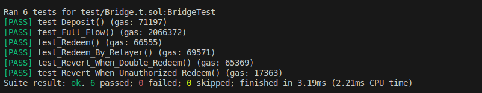
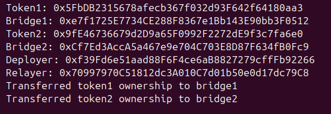
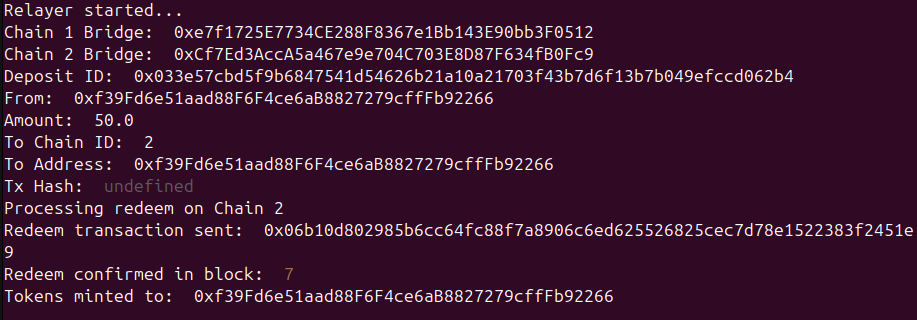

## ДЗ №1 — Кроссчейн мост между сетями
### Полушин Артём Алексеевич

## Архитектура моста

Мост реализует кросс-чейн переводы токенов между сетями через механизм burn/mint:

### Компоненты системы:
1. MyToken - ERC20 токен с возможностью mint/burn (только для владельца)
2. Bridge - контракт моста, управляющий переводом токенов между сетями
3. Relayer - сервер, отслеживающий события


## Юнит-тесты для конкракта моста
Запуск
```shell
$ forge build
$ forge test -vv
```


## Тестирование в локальной сети Anvil:
- **Deployer/Owner**: `0xf39Fd6e51aad88F6F4ce6aB8827279cffFb92266`
- **Relayer**: `0x70997970C51812dc3A010C7d01b50e0d17dc79C8`
- **Test User**: `0xf39Fd6e51aad88F6F4ce6aB8827279cffFb92266` (тот же что deployer)

## Адреса контрактов (локальная сеть )

### Chain 1:
MyToken address: `0x5FbDB2315678afecb367f032d93F642f64180aa3`
- **Bridge address**: `0xe7f1725E7734CE288F8367e1Bb143E90bb3F0512`

### Chain 2:
- **MyToken address**: `0x9fE46736679d2D9a65F0992F2272dE9f3c7fa6e0`
- **Bridge address**: `0xCf7Ed3AccA5a467e9e704C703E8D87F634fB0Fc9`


### Запуск
```shell
$ anvil
$ forge script DeployLocal --rpc-url http://localhost:8545 --broadcast
```

```shell
$ node relayer.js
```
